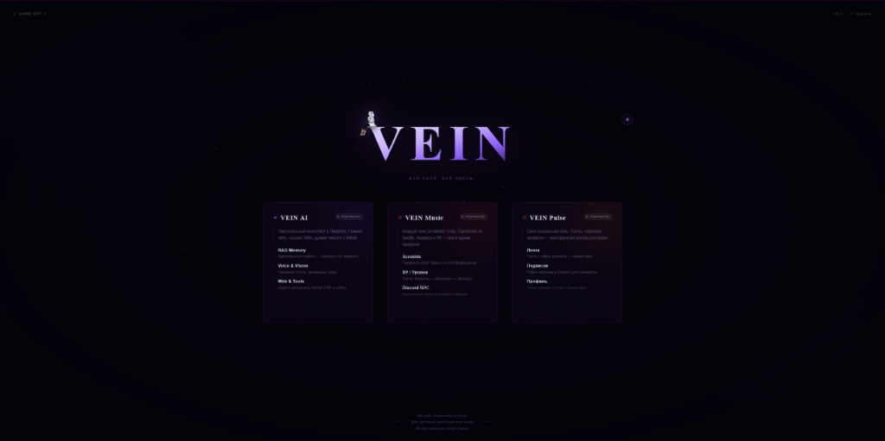

<div align="center">
  <h1>V E I N</h1>
  
  [](https://nextjs.org/)
  [](https://react.dev/)
  [](https://www.typescriptlang.org/)
</div>

<br>



Центральный хаб экосистемы **VEIN**. Проект служит единой точкой входа для всех личных сервисов, объединяя ИИ-инструменты, музыкальную статистику и социальное пространство в одном визуально насыщенном интерфейсе.

## ⚡ Особенности хаба

* **Ambient Design**: Интерактивный фон с динамической сеткой частиц на Canvas, реагирующий на движение курсора.
* **Text Scramble**: Эффект "хакерского" появления текста и динамические анимации при загрузке.
* **Custom Interaction**: Кастомный курсор с системой "шлейфа" (trail) и 3D-эффект наклона карточек.
* **Hub Ecosystem**: 
  - **VEIN AI**: Персональный помощник в Telegram.
  - **VEIN Music**: Агрегатор музыкальной статистики.
  - **VEINYMusic**: Discord Rich Presence для Яндекс Музыки.
  - **VEIN Pulse**: Личное социальное пространство.
  - **VEINClaw v6.0**: Автономный агент для управления инфраструктурой экосистемы.
* **Performance & SEO**: 
  - Высокая скорость загрузки благодаря Next.js App Router.
  - Полная SEO-оптимизация (Metadata, OpenGraph, sitemap.ts, robots.ts).

## 🛠 Технологический стек

- **Core**: Next.js 15+ (App Router), React 19
- **Logic**: TypeScript
- **Styling**: Vanilla CSS (Custom tokens, Glassmorphism, Advanced Animations)
- **Graphics**: HTML5 Canvas (Particle System)

## 📁 Структура проекта

- `app/` — Основная логика страниц и макетов.
- `app/globals.css` — Глобальная дизайн-система и анимации.
- `public/` — Статические ресурсы (изображения, аудио для пасхалок).

## 🚀 Как запустить

1. **Клон репозитория:**
   ```bash
   git clone https://github.com/Peaostrel/VEINEco.git
   cd VEINEco
   ```

2. **Установка зависимостей:**
   ```bash
   npm install
   ```

3. **Запуск в режиме разработки:**
   ```bash
   npm run dev
   ```

4. **Сборка для продакшена:**
   ```bash
   npm run build
   npm run start
   ```

---

<div align="center">
  <i>"всё своё. всё здесь."</i>
</div>
